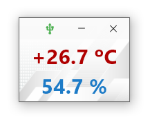

## i2c_aht21b
#### Программа для вывода показаний влажности и температуры с датчика AHT21b

    

---

#### Описание
Код для STM32 смотрим по адресу:  
https://github.com/sergeyerofeev/Projects_on_STM32F103/tree/main/i2c_aht21b

Программа каждую секунду опрашивает USB на наличие подключения STM32 с датчиком AHT21B.  
При наличии соединения происходит автоматическое подключение.

При разрыве соединения для температуры и влажности будут показаны символы '?', а программа перейдёт в цикл ожидания подключения.

    

При нажатии на кнопку закрытия, сохраняется положение окна на экране монитора и при повторном запуске, приложение развернётся в заданном месте экрана.